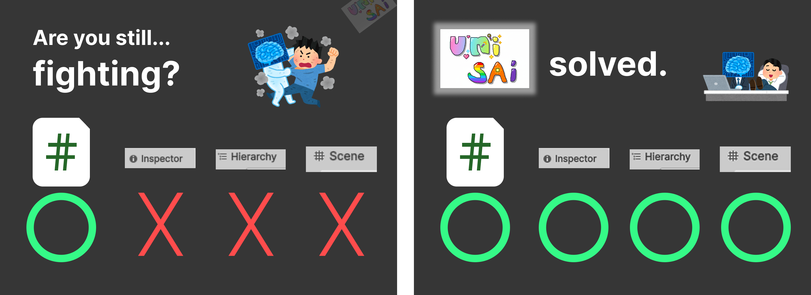
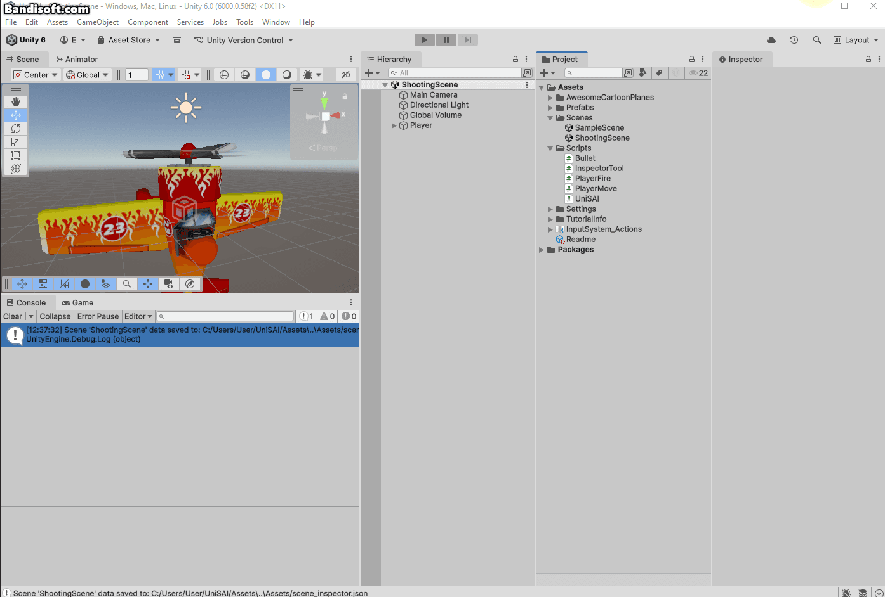
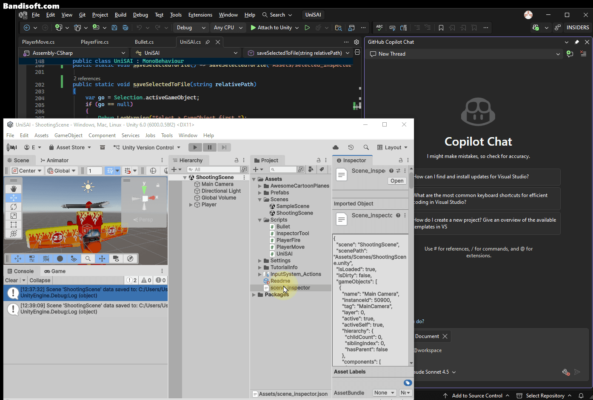
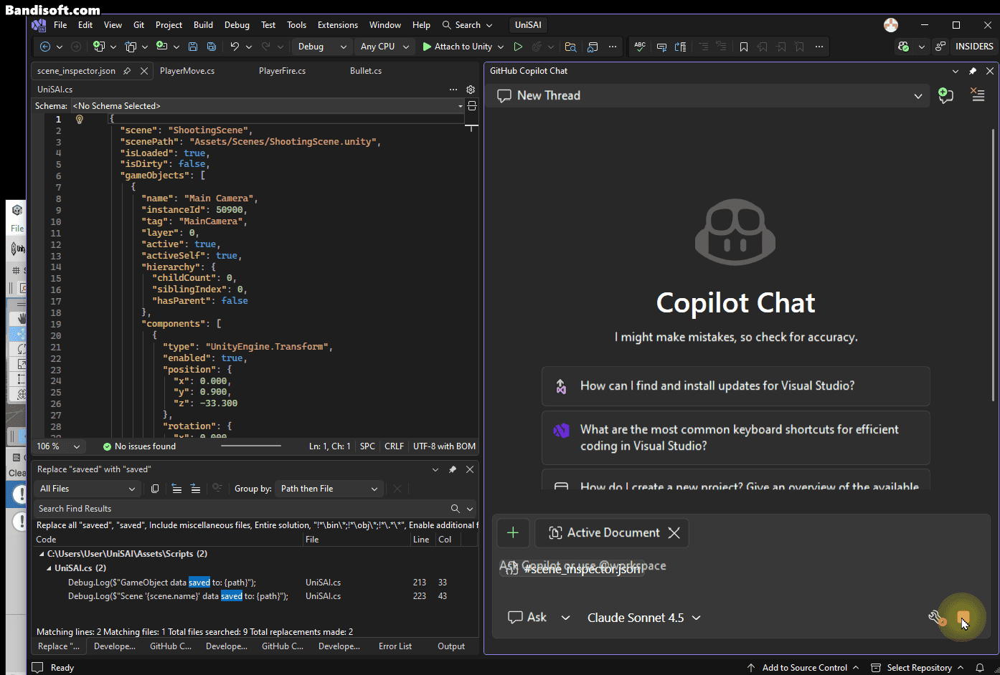

# UniSAI: AI-Friendly Unity Scene Analyzer

 

## What is UniSAI?

AI can't see your Unity Editor.
It only reads your scripts.
So the AI has to guess. This leads to bad suggestions.

**UniSAI** fixes this.

It's a powerful tool that helps AI understand your entire scene. UniSAI analyzes your scene and exports it as a JSON file. Give this file to your AI assistant. Now, it can provide truly smart coding support.

## How to Use

1.  Download `UniSAI.cs`.
2.  Drag it into your project.
3.  Go to `Tools > UniSAI > Analyze Current Scene`.
4.  You get a `.json` file.
5.  Give this JSON to your AI with your question. Now, it understands.

 
 
 

## Known Issues

big context, big Scene not tested
